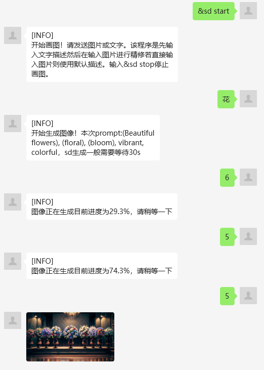
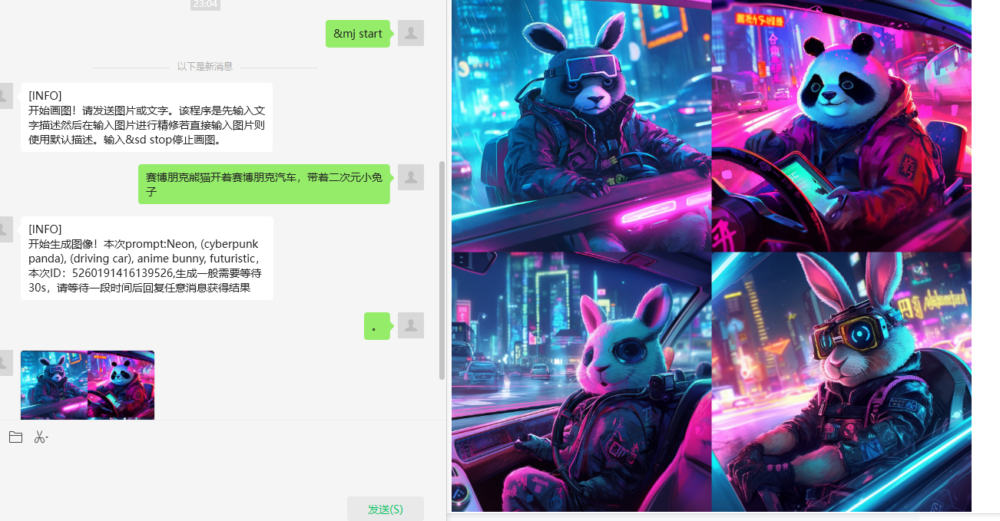

## 插件描述

本插件用于将画图请求转发给stable diffusion webui或者MidJourney，并且实现异步提交并且访问。**本插件基于wechatmp仅经过测试个人微信公众号**

> **已实现功能**：
>
> - [x] Stable Diffusion 接管画画请求
>
> - [x] 使用&sd (配置)来切换配置、模型
>
> - [x] 进行异步提交，并且可以查询当前进度
>
> - [x] 可以提交图片进行ControlNet修改
>
> - [x] 图片修复
>
> - [x] MidJourney接入
>
> **待实现的功能**：
>
> - [ ] MidJourney混图功能
>
> - [ ] MidJourney U1-4, V1-4选择图片功能
>
> - [ ] 相关提示，说明文档的优化入

## 环境要求

#### Stable_Diffusion前置，官方方式安装stable diffusion webui：

>安装stable diffusion webui，并在它的启动参数中添加 "--api"。[参考文章](https://github.com/AUTOMATIC1111/stable-diffusion-webui/blob/master/README.md#installation-and-running)
>
>##### windows:
>
>- 安装Python 3.10.6, 并勾选Add Python to PATH
>- 安装 [git](https://git-scm.com/download/win)
>- `git clone https://github.com/AUTOMATIC1111/stable-diffusion-webui.git`
>- 运行`webui-user.bat` 

### 使用整合包（推荐）

>使用[秋叶启动包](https://www.bilibili.com/video/BV1iM4y1y7oA/?spm_id_from=333.337.search-card.all.click&vd_source=02887443154cf0f76bbe965c3e32c0c8)，并且勾选`启用API`。可以选择`开放远程连接`，如果你的SD运行机器和公众号服务端不是一个电脑可以通过开放远程连接，并通过frp穿透实现调用sdapi。


部署运行后，保证主机能够成功访问http://127.0.0.1:7860/docs 

请**安装**本插件的依赖包```webuiapi```

```
pip install webuiapi
```

### 部署[midjourney-proxy](https://github.com/novicezk/midjourney-proxy)

>请跟随midjourney-proxy的说明文档来部署midjourney-proxy

## 使用说明

### 请修改以下两个文档的关键信息：

>`config.json.template` 中的所有"model"和"lora"选项，因为我预装的SD Model可能有所出00入。以及`base_url` ，这个是你所部署的mj-proxy所监听的地址，例如我部署在本地mj-proxy，并且监听8000端口，因此我的`"base_url" : "http://127.0.0.1:8000/mj"`
>
>```json
>"options":{
>    "model": "请修改为你想选择的默认模型", <- 需要修改
>    "lora": "请选择你选择默认Lora，可以留空", <- 需要修改
>    "controlnet_mod": "lineart", <- 可以修改
>    "controlnet_model": "control_v11p_sd15_lineart [43d4be0d]" <- 可以修改
>  },
>  "base_url": "请选择你的mj-proxy所监听的端口/mj", <- 需要修改
>```
>
>还有`user_config/sd_default.json` 
>
>```json
> "start":{
>        "host" : "127.0.0.1", <- 请修改为符合你设置的SD API地址
>        "port" : 7860, <- 符合你设置的监听端口
>        "use_https" : false
>  },
>"options": {
>        "model": "chilloutmix", <- 请修改
>        "lora": "<lora:add_detail:1>", <- 请修改
>        "controlnet_mod": "lineart",
>        "controlnet_model": "control_v11p_sd15_lineart [43d4be0d]"
>    } 
>```
>如果部署sdwebui的是在本机电脑上，请修改`port`到对应的端口。如果sdwebui和公众号不在一台机器上，请使用frp穿透，详情浏览：[frp](https://github.com/fatedier/frp)。将sdwebui的端口转发到公众号服务器上，并修改相应的端口。~~这个`start`其实不用放在这个个人配置json里的，但是懒得改了，就这样吧~~


我使用了两个json，一个json是`config.json`是用作`sd_mj.py`的各项命令配置，另一个json是`user_config/sd_default.json`，这个是用来加载每个用户独立配置的，有一个默认json模板`sd_default.json`，当每个用户第一次调用这个插件时会在`user_config`文件夹下生成一个`config_{session_id}`的个人配置文件。

将`config.json.template`复制为`config.json`，并修改其中的参数和规则。

```json
{
    "commands": ["help", "start", "stop", "config", "fix", "fstop"],
}
```

`commands`对应了sd_mj.py中检测的命令，如果命中其中的命令则执行对应的命令

```json
{
    "高清":{
        "params":{ 
        "enable_hr": true,
        "hr_scale": 1.6
      },
      	"options":{
      },
      	"desc": "出图分辨率长宽变为1.6倍"
    }
}
```

这个是`keywords`中的一个元素，对应的相应的配置，配置分为两个部分`params`和`options`，`params`是一些参数，详情可以查看参考：[sdwebuiapi](https://github.com/mix1009/sdwebuiapi/blob/a1cb4c6d2f39389d6e962f0e6436f4aa74cd752c/webuiapi/webuiapi.py#L114)，[txt2img api](https://github.com/mix1009/sdwebuiapi/blob/fb2054e149c0a4e25125c0cd7e7dca06bda839d4/webuiapi/webuiapi.py#L163)。`options`是我用来方便调用`api.util_set_model()`来设置模型，lora和ControlNet的。`desc`是输出说明文档使用的。

`gpt_prompt`是我用作将输入的描述经过Chatgpt转换成SD的prompt所使用的Chatgpt的prompt

```json
"gpt_prompt": "我正在使用一个叫做Stable_Diffusion的AI图像生成工具。我想让你充当关键词生成器。我将在我想生成的主题之前添加\"/\"你会生成各种关键词。例如，如果我输入\"/在高速公路上疾驰的汽车\"，你将生成精准的英文描述词，不需要生僻、华丽的描述词，只需要通俗准确的描述。模版如下：(subject)(style), (action/scene), (artist), (filters)。 (subject) 代表画面的主题，锚定画面内容，这是任何提示的基本组成部分。(style) 是画面风格，可选。(action/scene) 代表动作/场景，描述了主体在哪里做了什么。(artist) 代表艺术家名字或者出品公司名字。(filters) 代表一些细节，补充。可以使用 艺术家，工作室，摄影术语，角色名字，风格，特效等等。描述时对象和行为必须用()强调，例如(a car driving on the highway)用来强调对象和行为。下面我给出一个完整示例:\"photorealistic, (a car driving on the highway), speed fast, sunlight\"。其中photorealistic代表画风主题是照片写实风，(a car driving on the highway)表示主体和主体的行为，speed fast和sunlight表示对象的细节。当我没给你提供风格或者其他条件的时候，你自己选择适合的描述给我，当你回复我的时候必须照着这个模板给我，并且模仿完整示例一样只回复英文单词，不加引号并且不需要添加任何注释，所有的单词均在一行内给出，不需要添加回车。剔除掉不健康的单词。现在我要给你第一个任务，/"
```

哪位大手子有更好的prompt可以自行修改，并且互相探讨。

```json
{
    "params":{
        
    },
    "options":{
        
    }
}
```

请根据个人喜好修改相应的`params`，并且修改`options`中的`model`和`lora`。以免model不存在使得功能无法正常运行

### 插件逻辑

当输入有{trigger_prefix}sd start的时进入画画模式，因为我用的是&，所以演示用&sd。

```
&sd start
```

然后可以进行描述，经由Chatgpt转换成相应的对应prompt，并交给后台sd进行绘图，返回当前生成的prompt和提交任务提示。在输入任意文字可以获取当前进度。



当需要进行查看个人配置时可以输入`&sd config `。


当需要修改个人配置的时候输入`&sd 关键词`例如`&sd 二次元`可以将对应的`options`和`params`替换为你预设的模板


个人默认参数`sd_default.json`如下:
```json
{
    "start":{
        "host" : "127.0.0.1",
        "port" : 7860,
        "use_https" : false
  },
    "params": {
        "sampler_name": "DPM++ SDE Karras",
        "steps": 30,
        "width": 960,
        "height": 540,
        "cfg_scale": 7,
        "prompt":"masterpiece, best quality, ",
        "negative_prompt": "verybadimagenegative_v1.3, EasyNegative, badhandv4, badhandsv5-neg, bad-picture-chill-75v, NSFW, (worst quality:2), (low quality:2), (normal quality:2)",
        "enable_hr": false,
        "hr_scale": 1,
        "hr_upscaler": "ESRGAN_4x",
        "hr_second_pass_steps": 15,
        "denoising_strength": 0.6
    },
    "options": {
        "model": "chilloutmix",
        "lora": "<lora:add_detail:1>",
        "controlnet_mod": "lineart",
        "controlnet_model": "control_v11p_sd15_lineart [43d4be0d]"
    } 
}
```

### MidJourney支持：

输入`&mj start`，启动MJ绘图模式：先输入文字描述，画完之后在传入图片才能实现图生图，主要还是个人公众号的条件太差没做更多的接口，否则可以实现公众号一键开始。




## 版本：

- version 1.1:加入了Midjourney支持和Stable_Diffusion的图片修复功能
- version 1.0:基础版本，支持了Stable_Diffusion的txt2img和基于ControlNet的读图系统

## 鸣谢

- [sdwebuiapi](https://github.com/mix1009/sdwebuiapi)
- [chatgpt-on-wechat](https://github.com/zhayujie/chatgpt-on-wechat/tree/master)

## 开源协议

This project is licensed under the terms of the MIT license. See the [LICENSE](LICENSE) file for details.
